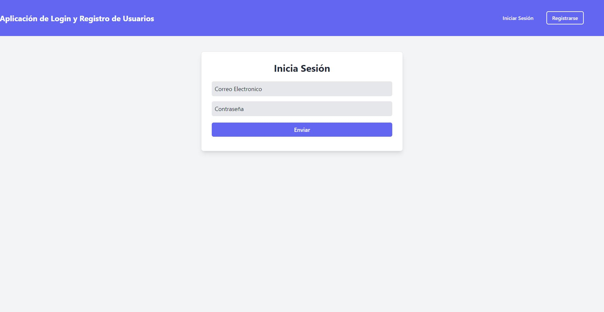
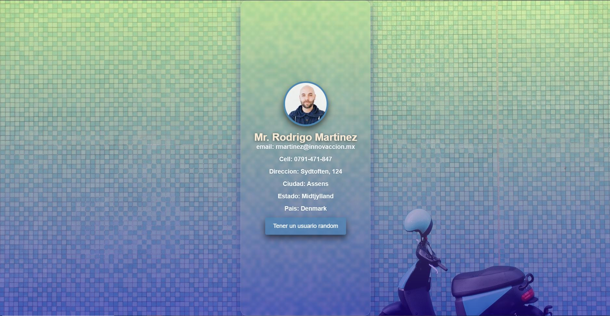

# Test de habilidades técnicas de diagnostico 

- Caso 1 [Sistema de registro](http://thawing-beyond-16316.herokuapp.com/login) 
  Esta aplicacion fue creada utilizando los siguientes recursos:
  1. [Tailwind](https://tailwindcss.com)
  2. [php8](https://www.php.net/releases/8.0/es.php#:~:text=PHP%208.0%20es%20una%20actualización,sistema%20de%20tipos%2C%20manejo%20de)
  3. [Laravel](https://laravel.com)
  4. [PostgreSQL](https://www.postgresql.org)
  5. [Heroku](https://www.heroku.com/what)
  
  
<a href="http://thawing-beyond-16316.herokuapp.com/login" target="blank">
</a>
---
   
- caso 2 [Consulta de API](https://hopeful-davinci-cb54b7.netlify.app) 
  Esta aplicacion fue creada utilizando los siguientes recursos:
  1. [HTML5](https://developer.mozilla.org/es/docs/Glossary/HTML5)
  1. [CSS3](https://www.w3schools.com/css/)
  1. [JavaScript](https://developer.mozilla.org/en-US/docs/Web/JavaScript)
  1. [Vuejs](https://vuejs.org)
  
  
<a href="https://hopeful-davinci-cb54b7.netlify.app" target="blank">
</a>

